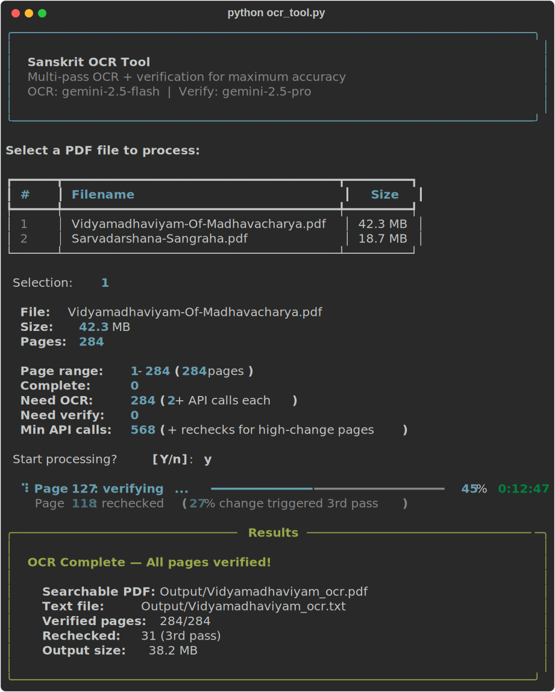
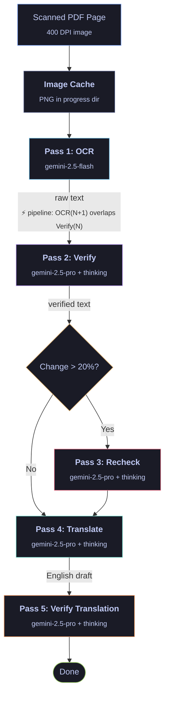

<div align="center">
  <br>
  
  <br><br>
  <p>
    <a href="#quick-start"></a>
    &nbsp;
    <a href="LICENSE"></a>
    &nbsp;
    <a href="https://aistudio.google.com/apikey"></a>
  </p>
  <p><em>Multi-pass OCR pipeline for scanned Sanskrit and Devanagari books using Google Gemini vision models.</em></p>
</div>

<br>

Akshara uses Gemini's vision models to transcribe scanned book PDFs with a pipeline that catches the subtle errors traditional OCR misses — wrong visargas, mangled conjuncts, truncated table-of-contents lines. It saves progress after every API call, so interrupted runs resume exactly where they left off.

<br>

<p align="center">
  
</p>

## Features

- **Multi-pass accuracy pipeline** — Fast OCR with Gemini Flash, then character-by-character verification with Gemini Pro + extended thinking. A third pass auto-triggers when verification changes more than 20% of the text.
- **Page-type-aware prompts** — Detects tables of contents, verse pages, and prose commentary, then uses specialized verification instructions for each.
- **Crash-proof progress** — Every page result is saved to disk immediately. Resume any interrupted run without repeating API calls.
- **Pipelined processing** — OCR and verification calls overlap using a thread pool: while Gemini Pro verifies page N, Gemini Flash OCRs page N+1. Same API calls, less wall-clock time.
- **Image caching** — Page images are cached as lossless PNGs in the progress directory. Resuming a run skips PDF-to-image conversion entirely. Caches auto-invalidate if the source PDF changes, and are pruned after successful processing (retain with `--keep-cache`).
- **Dual output** — Produces both a plain text file and a searchable PDF (scanned images with invisible text overlay).
- **Sanskrit-to-English translation** — Translates OCR'd text using Gemini Pro with a sliding window of previous pages for terminology continuity. Each translation is verified against the Sanskrit source.
- **Rate limit handling** — Detects API rate limits, saves all progress, and exits cleanly so you can resume later.

## Quick Start

```bash
# 1. Clone and install
git clone https://github.com/SangeethsivanSivakumar/Akshara.git
cd Akshara
python -m venv venv
source venv/bin/activate
pip install -r requirements.txt

# 2. Install poppler (required for PDF-to-image conversion)
brew install poppler        # macOS
# sudo apt install poppler-utils   # Ubuntu/Debian

# 3. Add your Gemini API key
cp .env.example .env
# Edit .env and add your key (free at https://aistudio.google.com/apikey)

# 4. Place PDFs in Source/ and run
mkdir -p Source
python ocr_tool.py

# 5. Translate an already-OCR'd book to English
python ocr_tool.py --translate

# 6. Keep cached page images after processing (skipped by default)
python ocr_tool.py --keep-cache
```

The interactive CLI will prompt you to select a PDF, choose a page range, and handle any existing progress.

**Translation workflows:**

- **After OCR** — When all pages in the selected range are fully verified, the CLI will ask *"Translate to English?"* (defaults to no). Accepting starts translation immediately using the same session.
- **Standalone (`--translate`)** — Runs translation on a book that has already been OCR'd. The tool detects the page range from existing progress files. If the selected PDF has no OCR progress, it exits with an error (*"No OCR progress found for this PDF. Run OCR first."*) — it will not automatically run OCR.

```
python ocr_tool.py --help
```

## How It Works



Each page's result is saved to `Output/{book}_progress/` as it completes:

```
page_0001_ocr.txt  →  page_0001_verified.txt  →  page_0001_rechecked.txt
     (Pass 1)              (Pass 2)                  (Pass 3, if needed)

page_0001_translated.txt  →  page_0001_translation_verified.txt
        (Pass 4)                       (Pass 5)
```

## What the Verification Catches

The verify pass is specifically tuned for Sanskrit/Devanagari. Here are common errors it fixes:

| Error type | OCR output (Pass 1) | After verification (Pass 2) |
|:---|:---|:---|
| Dropped visarga (ः) | `प्रथमोध्याय` | `प्रथमोऽध्यायः` |
| Wrong conjunct | `ग्नन्थः` | `ग्रन्थः` |
| Missing anusvara (ं) | `ससकृतम्` | `संस्कृतम्` |
| Swapped ट/ठ | `ठीका` | `टीका` |
| Truncated TOC row | *(line missing)* | `विद्यामाधवीयम् .... ४२` |

## Configuration

All tunables are constants at the top of `ocr_tool.py`:

| Constant | Default | Description |
|:---|:---|:---|
| `DPI` | `400` | Resolution for PDF page rendering |
| `GEMINI_MODEL_OCR` | `gemini-2.5-flash` | Model for Pass 1 (OCR) |
| `GEMINI_MODEL_VERIFY` | `gemini-2.5-pro` | Model for Pass 2/3 (verification) |
| `THINKING_BUDGET_VERIFY` | `2048` | Thinking tokens for verification |
| `RECHECK_THRESHOLD` | `0.20` | Change ratio that triggers Pass 3 |
| `MAX_OUTPUT_TOKENS` | `16384` | Max tokens per API response |
| `INTER_CALL_DELAY` | `1.0` | Seconds between API calls |
| `PDF_DPI` | `200` | Resolution for searchable PDF background images |
| `PROGRESS_JSON_INTERVAL` | `10` | Write progress.json every N API calls |
| `GEMINI_MODEL_TRANSLATE` | `gemini-2.5-pro` | Model for translation passes |
| `THINKING_BUDGET_TRANSLATE` | `2048` | Thinking tokens for translation |
| `CONTEXT_WINDOW_PAGES` | `3` | Previous pages included as translation context |

## Output

After processing, you'll find in the `Output/` directory:

```
Output/
├── Vidyamadhaviyam_ocr.txt              # Combined Sanskrit text, all pages
├── Vidyamadhaviyam_ocr.pdf              # Searchable PDF (images + invisible text)
├── Vidyamadhaviyam_translation.txt      # Combined English translation
├── Vidyamadhaviyam_translation.pdf      # English translation PDF (readable text)
└── Vidyamadhaviyam_progress/            # Per-page intermediate files
    ├── page_0001.png                        # Cached page image (pruned after processing)
    ├── page_0001_ocr.txt
    ├── page_0001_verified.txt
    ├── page_0001_rechecked.txt              # Only if Pass 3 was triggered
    ├── page_0001_translated.txt             # English translation
    ├── page_0001_translation_verified.txt   # Verified translation
    ├── page_0002.png
    ├── page_0002_ocr.txt
    ├── ...
    └── progress.json                        # Summary (convenience only)
```

The `_progress/` directory is safe to delete once you're satisfied with the output.

## Requirements

- Python 3.9+
- [Poppler](https://poppler.freedesktop.org/) (`pdfinfo` and `pdftoppm` must be on PATH)
- A [Google Gemini API key](https://aistudio.google.com/apikey) (free tier works)
- A Unicode font with Devanagari support (for the searchable PDF text layer — Arial Unicode MS on macOS works automatically)

## License

[MIT](LICENSE)
